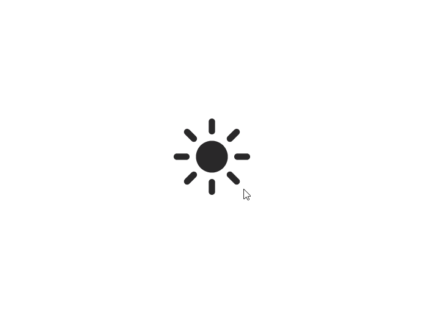

# svelte-dark-mode-toggle

[](https://www.npmjs.com/package/svelte-dark-mode-toggle)

SvelteJS component for toggling dark mode. There's just a button with cute animation without dark mode logic realization.



## Demo

[REPL Link](https://svelte.dev/repl/5773cfc57bf247778e49860874436b27?version=4.2.0)

## Installation

```bash
npm install svelte-dark-mode-toggle
```

Or with Yarn

```bash
yarn add svelte-dark-mode-toggle
```

## Usage

```svelte
<script>
  import DarkModeToggle from 'svelte-dark-mode-toggle'

  let darkMode = false
</script>

<h1>The simpliest usage</h1>
<DarkModeToggle {darkMode} on:click={() => darkMode = !darkMode}/>

```

## API

### Props

| Name                | Type                         | Default Value                   | Description                               |
| ------------------- | ---------------------------- | ------------------------------- | ----------------------------------------- |
| darkMode            | boolean                      |                                 | Current mode state                        |
| size                | string                       | 28px                            | Size of component (passed to svg)         | 
| title               | string                       | Toggle dark mode                | Hint on hover (passed to button)          |
| lightModeColor   | string                       | #000000                              | Color of sun                                |
| lightModeHover | string                       | #292828 | Color of sun of hover    |
| darkModeColor           | string                       | #FFFFFF                          | Color of the moon.                        |
| darkModeHover            | string                       | #e6e6e6                          | Color of the moon on hover               |
| animationDuration     | string                       | .25s               | transition-duration value          |
| animationDelay              | string                       | .25s               | transition-delay value for moon transformation         |

### Events

| Event Name | Description          |
| ---------- | -------------------- |
| click      | Classic click event  |

## License

MIT

## Show your support

Give a ⭐️ if this project helped you!
